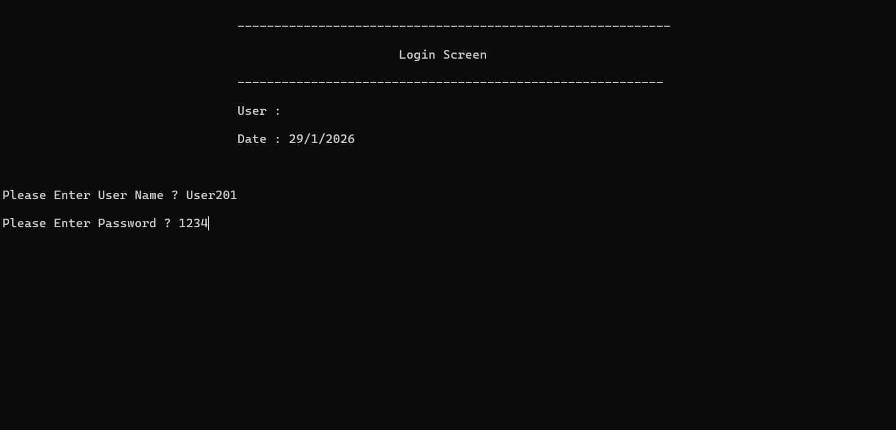
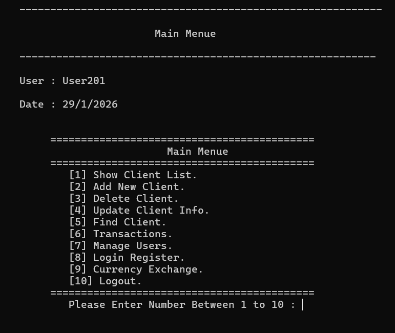
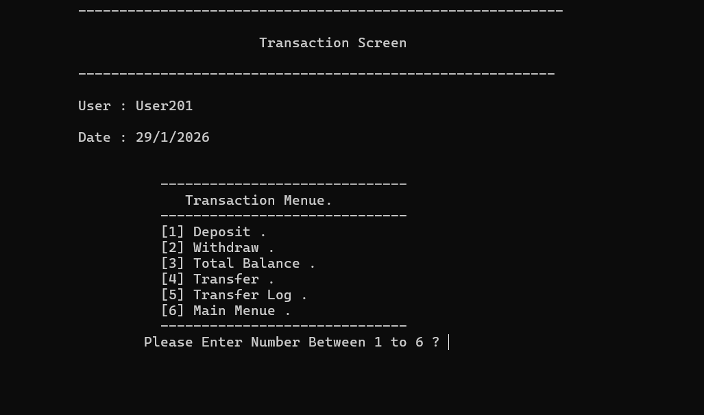
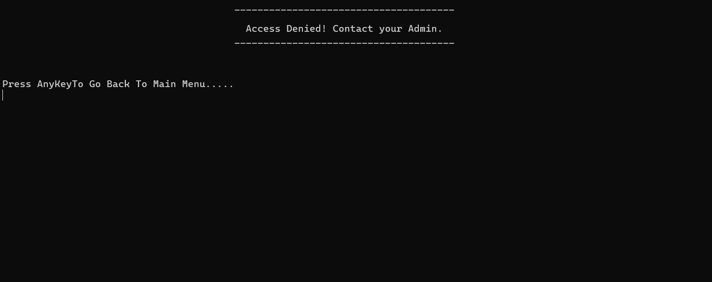

# 🏦 Advanced Bank Management System (C++ / OOP)

## 📌 Project Overview
Developed by **Maher Sawsak**, this is a professional-grade Banking Management System built with **C++**. The project features a highly modular architecture with **45 distinct files**, ensuring a strict **Separation of Concerns**.

## 🔐 Security & Core Logic
* **Data Encryption:** Custom layer for encrypting passwords before file storage.
* **Modular Design:** 45 separate headers and classes for scalability.
* **OOP Mastery:** Advanced use of Inheritance, Encapsulation, and Polymorphism.

## 📸 System Gallery

| Login Screen | Main Dashboard |
|:---:|:---:|
|  |  |

| Transactions Hub | User Permissions |
|:---:|:---:|
|  |  |

---
**Developed by:** Maher Sawsak  
**Position:** 3rd Year Software Engineering Student (Turkey)